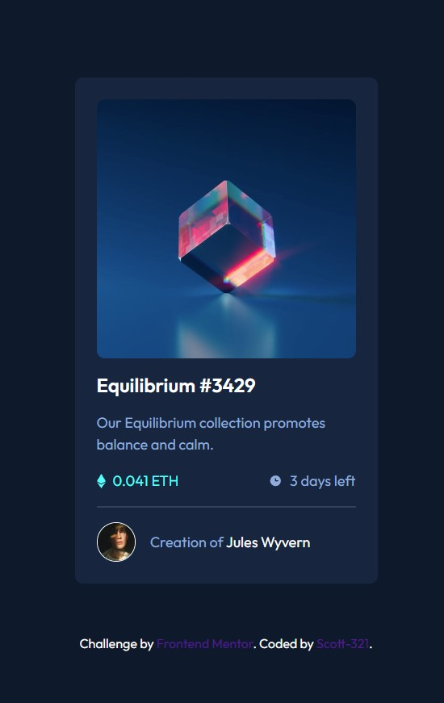

# Frontend Mentor - NFT preview card component solution

This is a solution to the [NFT preview card component challenge on Frontend Mentor](https://www.frontendmentor.io/challenges/nft-preview-card-component-SbdUL_w0U). Frontend Mentor challenges help you improve your coding skills by building realistic projects. 

## Table of contents

- [Overview](#overview)
  - [The challenge](#the-challenge)
  - [Screenshot](#screenshot)
- [My process](#my-process)
  - [Built with](#built-with)
  - [What I learned](#what-i-learned)
  - [Continued development](#continued-development)

## Overview

To build out a preview card component and get it looking as close to the design as possible. You can use any tools you like to help you complete the challenge.

### The challenge

Users should be able to:

- View the optimal layout depending on their device's screen size
- See hover states for interactive elements

### Screenshot

## My process

I studied the instructions and design before writing my HTML. I styled my HTML elements using a mobile-first workflow, starting at the top and working down through the sections.

### Built with

- Semantic HTML5 markup
- CSS custom properties
- Flexbox
- Mobile-first workflow

### What I learned

It was really good to revisit the position absolute and the z-index properties to position elements on top of one another.

### Continued development

I am looking forward to the next project and applying what I have been learning into practice.